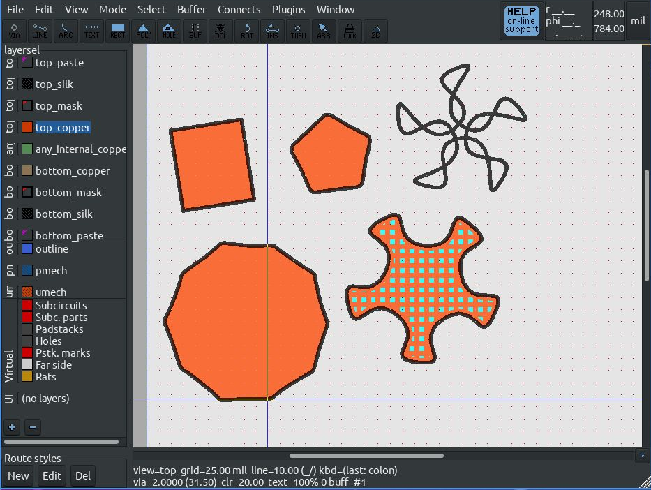

# inkscape2pcb
inkscape2pcb contains inkscape extension scripts that allow export of inkscape paths to pcb-rnd subcircuits (.lht) and gEDA PCB footprints (.fp) on the top silk layer.

The pcb-rnd export script has been updated to also export simple polygon paths to the top copper layer. Self intersecting polygons are not exported.

The scripts are based on the HPGL export script that ships with inkscape.

The scripts need to be added to your local inkscape extension script directory, for example

/usr/share/inkscape/extensions

before starting up inkscape again.

On loading, inkscape will find the scripts, at which point the "Save As" menu will allow saving to pcb-rnd (.lht) subcircuit formats, and also gEDA PCB footprint (.fp) formats.

Currently, the exporter only exports lines and paths as line elements. Squares, polygons, circles, ellipses and other types of content are not exported. Accordingly, any object which is to be exported must be converted to a path first.

Line width can be specified in the export dialogue; 8mil is the default minimum (less than this is not necessarily supported by many fabs for silkscreens, for example), and can range up to 250mil. If this is not appropriate, the thickness can be changed further in pcb-rnd or gEDA PCB anyway. 

Currently, the exporter exports to mil units, where 1px in Inkscape = 1 mil in the exported layout. It is recommended that any lines or nodes on lines needing to have a specific coordinates be created, and then each node individually clicked on within Inkscape to allow precise coordinates to be specified for each node. This is a more precise method for specifying geometry than simply clicking with the mouse.

Exported gEDA PCB footprints are natively supported by gEDA PCB, pcb-rnd, and Kicad.

Kicad users using pcbnew will find that the footprint has to be imported from within the module editor. There is no other way to import it from the file menu or from the library browser/library configuration menu in pcbnew.

This tool is an effective way to export Hershey font text from Inkscape to footprints for use on PCB layouts in gEDA PCB, pcb-rnd, and Kicad.

It should be noted that pcb-rnd now has multiple font support built in, allowing multiple fonts to be used in a layout with the text tool.

The pcb-rnd (.lht) exporter and gEDA (.fp) exporter have been updated to work with Inkscape 1.1

They have not been tested with Inkscape v1.0 but should work with it, as API and python 2.x -> 3.x changes occurred at the Inkscape v0.9x to v1.0 transition.

Licence is GPL2, or at your option, a newer GPL licence.
